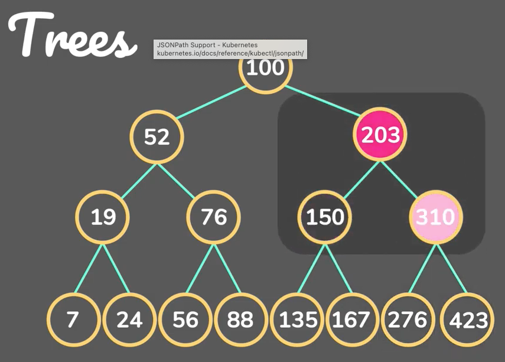

__BINARY SEARCH TREE__

**MOTIVATION**
- This is a tree structure that  has nodes with no more than 2 children.
- Some of the left or right nodes may be empty.
- You add a node to the tree by trarvesing down until you find an empty space. Right for larger and left for smaller.
- Search also follows the same principles.
- A tree has a very speedy search time complexity - `O(log n)`
- Smaller child is placedd aon the left and larger child placed on the right

