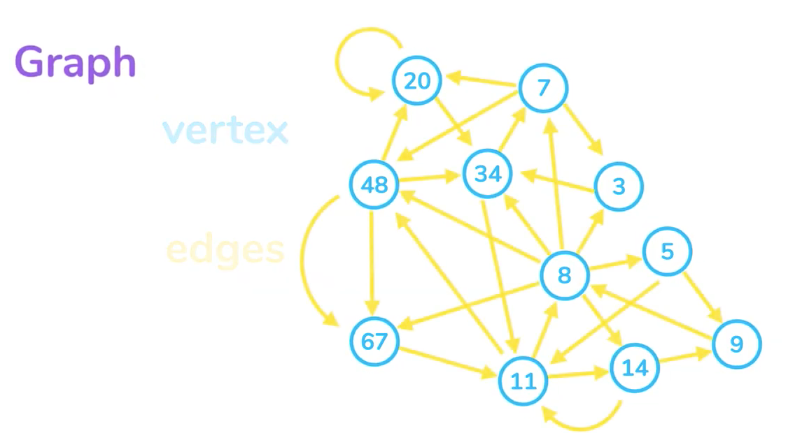
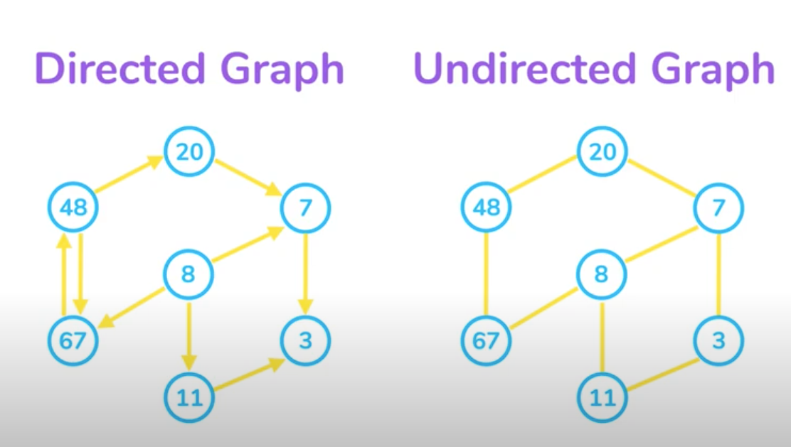
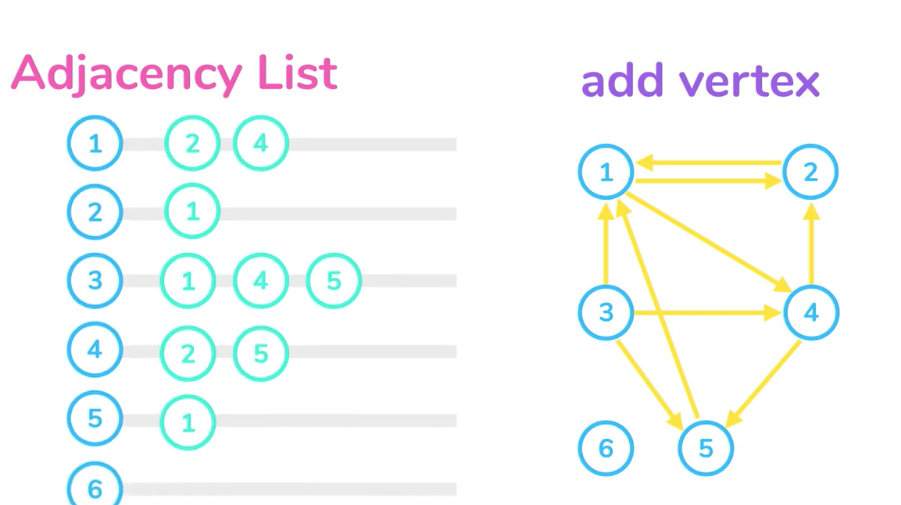
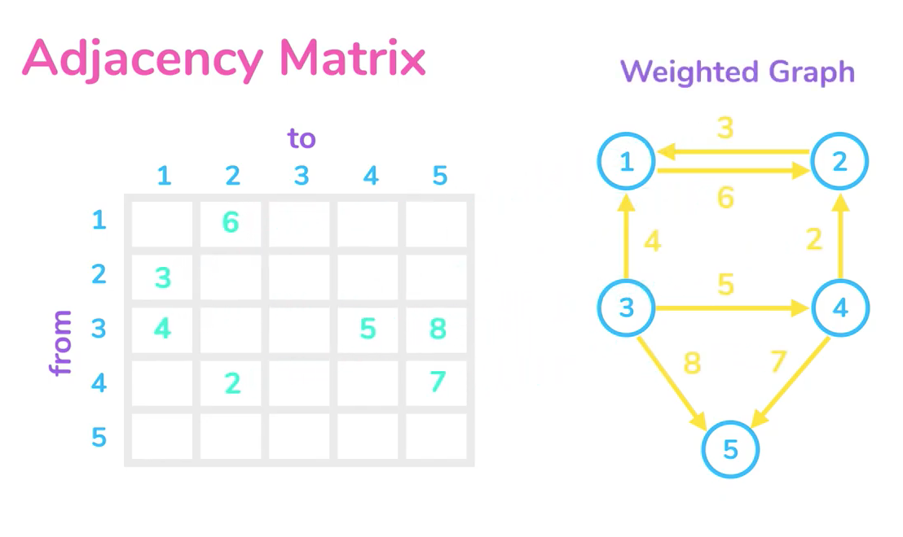
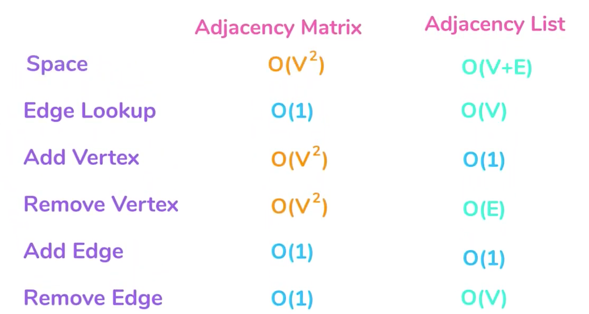

__GRAPHS__

**MOTIVATION**

- This is almost like a tree but with more connections between nodes

  
- The nodes are called **vertex** and theconnections are called **edges**.
- When a graph has many edges its called dense
- When it has less edges its called a sparse graph.
- Graphs are an abstract data type and can be **directed** or **undirected**

  
- You can also put weights on the edges
- There are 2 ways of representing a common graph in code
***
**Adjacency List**
- Expressed as a list of vertexes

**Adjecency Matrix**
- This is through a 2D-Array
- The matrix can hold wieghts

  
***

**COMPARISON**

