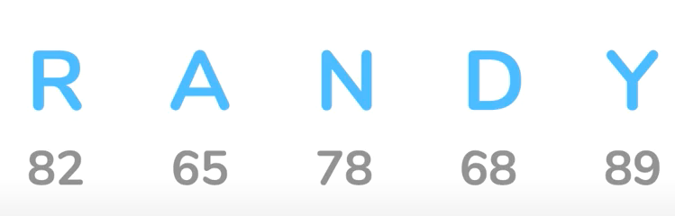
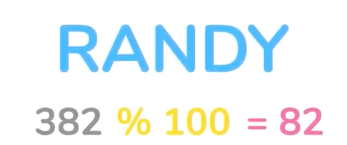
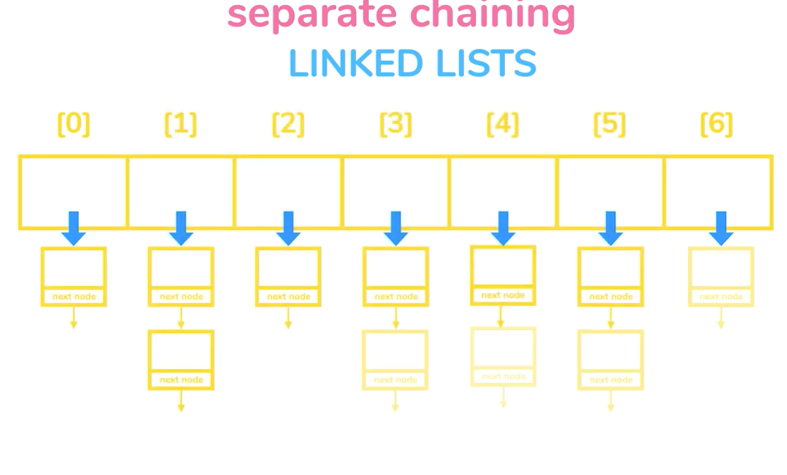

__HASH TABLES__

**MOTIVATION**
- We need a hash function to convert a value into an index that we can use to search for values
- The harsh code is what is going to be used to search for specific values.
- Storage also needs to use the same hash function
- An example will be 
  - Converting each letter in a word into its ASCII equivalent
  - We then sum it up and divide by 100 and get remainder
    
  - We use 100 because it is he size of the array we
    
    
- There is a possibility however, to have 2 names create the same hash code resulting in a _**collision**_.

***

**Open Addressing collision handling**
- When the address is already taken, we store on the next index
- Searching does this also.
- As the array starts growing more and more we start to see the values drift further and further away from form their original index and loose the advantages.

**Separate Chaining**
- Storing multiple names in 1 index
- You use linked lists for this
- Each address points to the head of a linked list.

