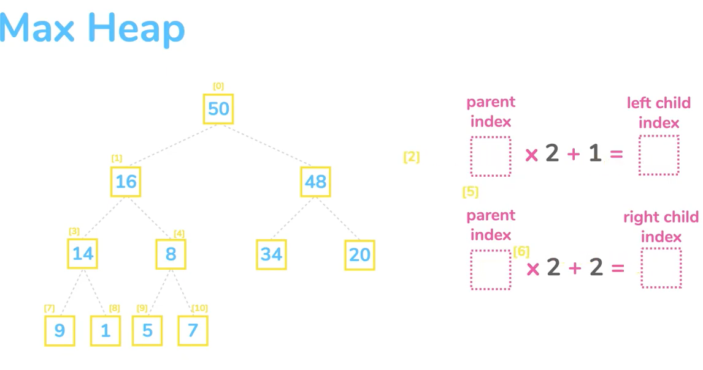

__HEAPS__

**MOTIVATION**

- This is an array in code
- Used for implementing priority queues
- Can be expressed as a complete tree
- All the nodes are complete.
- In a binary heap the nodes have up to 2 children
- Largest key is stores in the root
- A maxheap can be used when we continuously need to remove the largest key
- They are an array that operates like a tree

  
``
parent_index * 2 + 1 = left_child
``

``
parent_index * 2 + 2 = right_child
``

The bottom right key is the last index in the array. We re-arrange the nodes after insertion
After removing the root we take the last key and replace the root. Then we start swapping downwards
