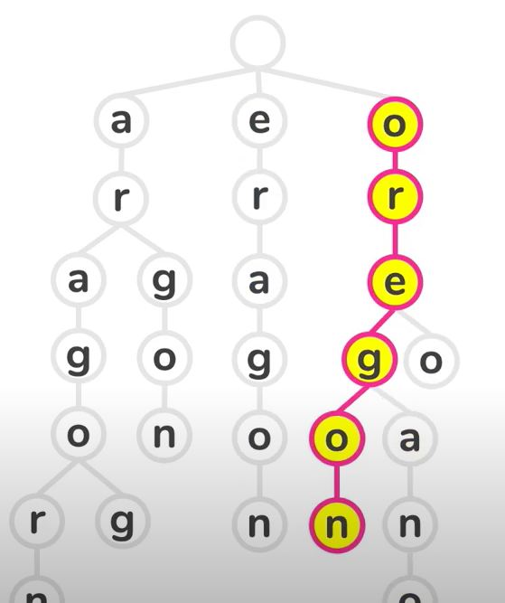

__TRIE DATA STRUCTURE__

**MOTIVATION**
- This is a tree structure mostly used for storing words
- Each node represents a word or part of a word.
- Lets us search words really fast
- One application for this is auto-complete
- The nodes need a boolean value to indicate if its the end of a word
- They have a tradeoff between time and space

